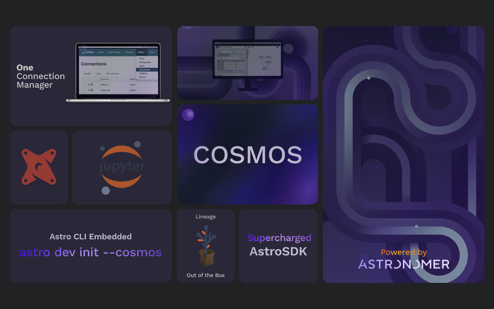

.. image:: https://badge.fury.io/py/astronomer-cosmos.svg
    :target: https://badge.fury.io/py/astronomer-cosmos
    
Astronomer Cosmos
=================

A framework for generating `Apache Airflow <https://airflow.apache.org/>`_ DAGs from other workflows.

Quickstart
_____________

Clone this repository to set up a local environment. Then, head over to our :code:`astronomer-cosmos/examples` directory and follow its README! 

Installation
_____________

Install and update using `pip <https://pip.pypa.io/en/stable/getting-started/>`_:

.. code-block:: bash

    pip install astronomer-cosmos

This only installs dependencies for core provider. To install all dependencies, run:

.. code-block:: bash

    pip install 'astronomer-cosmos[all]'

To only install the dependencies for a specific integration, specify the integration name as extra argument, example
to install dbt integration dependencies, run:

.. code-block:: bash

    pip install 'astronomer-cosmos[dbt]'

Extras
^^^^^^

.. EXTRA_DOC_START

.. list-table::
   :header-rows: 1

   * - Extra Name
     - Installation Command
     - Dependencies

   * - ``all``
     - ``pip install 'astronomer-cosmos[all]'``
     - All

   * - ``dbt``
     - ``pip install 'astronomer-cosmos[dbt]'``
     - dbt core

Example Usage
_____________

Imagine we have dbt projects located at ``./dbt/{{DBT_PROJECT_NAME}}``. We can render these projects as a Airflow DAGs using the ``DbtDag`` class:

.. code-block:: python

    from pendulum import datetime
    from airflow import DAG
    from cosmos.providers.dbt.dag import DbtDag

    # dag for the project jaffle_shop
    jaffle_shop = DbtDag(
        dbt_project_name="jaffle_shop",
        conn_id="airflow_db",
        dbt_args={
            "schema": "public",
        },
        dag_id="jaffle_shop",
        start_date=datetime(2022, 11, 27),
        schedule="@daily",
        doc_md=__doc__,
        catchup=False,
        default_args={"owner": "01-EXTRACT"},
    )

    # dag for the project attribution-playbook
    attribution_playbook = DbtDag(
        dbt_project_name="attribution-playbook",
        conn_id="airflow_db",
        dbt_args={
            "schema": "public",
        },
        dag_id="attribution_playbook",
        start_date=datetime(2022, 11, 27),
        schedule="@daily",
        doc_md=__doc__,
        catchup=False,
        default_args={"owner": "01-EXTRACT"},
    )

    # dag for the project mrr-playbook
    mrr_playbook = DbtDag(
        dbt_project_name="mrr-playbook",
        conn_id="airflow_db",
        dbt_args={
            "schema": "public",
        },
        dag_id="mrr_playbook",
        start_date=datetime(2022, 11, 27),
        schedule="@daily",
        doc_md=__doc__,
        catchup=False,
        default_args={"owner": "01-EXTRACT"},
    )

Simiarly, we can render these projects as Airflow TaskGroups using the ``DbtTaskGroup`` class. Here's an example with the jaffle_shop project:

.. code-block:: python

    """
    ## Extract DAG

    This DAG is used to illustrate setting an upstream dependency from the dbt DAGs. Notice the `outlets` parameter on the
    `EmptyOperator` object is creating a
    [Dataset](https://airflow.apache.org/docs/apache-airflow/stable/concepts/datasets.html) that is used in the `schedule`
    parameter of the dbt DAGs (`attribution-playbook`, `jaffle_shop`, `mrr-playbook`).

    """

    from pendulum import datetime

    from airflow import DAG
    from airflow.datasets import Dataset
    from airflow.operators.empty import EmptyOperator
    from cosmos.providers.dbt.task_group import DbtTaskGroup

    with DAG(
        dag_id="extract_dag",
        start_date=datetime(2022, 11, 27),
        schedule="@daily",
        doc_md=__doc__,
        catchup=False,
        default_args={"owner": "01-EXTRACT"},
    ) as dag:

        e1 = EmptyOperator(
            task_id="ingestion_workflow", outlets=[Dataset("DAG://EXTRACT_DAG")]
        )

        dbt_tg = DbtTaskGroup(
            group_id="dbt_tg",
            dbt_project_name="jaffle_shop",
            conn_id="airflow_db",
            dbt_args={
                "schema": "public",
            },
            dag=dag,
        )

        e2 = EmptyOperator(
            task_id="some_extraction", outlets=[Dataset("DAG://EXTRACT_DAG")]
        )

        e1 >> dbt_tg >> e2

Principles
_____________

`Astronomer Cosmos` provides a framework for generating Apache Airflow DAGs from other workflows. Every provider comes with two main components:

- ``extractors``: These are responsible for extracting the workflow from the provider and converting it into ``Task`` and ``Group`` objects.
- ``operators``: These are used when the workflow is converted into a DAG. They are responsible for executing the tasks in the workflow.

``Astronomer Cosmos`` is not opinionated in the sense that it does not enforce any rendering method. Rather, it comes with the tools to render workflows as Airflow DAGs, task groups, or individual tasks.

Changelog
_________

We follow `Semantic Versioning <https://semver.org/>`_ for releases.
Check `CHANGELOG.rst <https://github.com/astronomer/astronomer-cosmos/blob/main/CHANGELOG.rst>`_
for the latest changes.

Contributing Guide
__________________

All contributions, bug reports, bug fixes, documentation improvements, enhancements are welcome.

A detailed overview an how to contribute can be found in the `Contributing Guide <https://github.com/astronomer/astronomer-cosmos/blob/main/CONTRIBUTING.rst>`_.

As contributors and maintainers to this project, you are expected to abide by the
`Contributor Code of Conduct <https://github.com/astronomer/astronomer-cosmos/blob/main/CODE_OF_CONDUCT.md>`_.

Goals for the project
_____________________

- Goal 1
- Goal 2
- Goal 3

Limitations
___________

- List any limitations

License
_______

`Apache License 2.0 <https://github.com/astronomer/astronomer-cosmos/blob/main/LICENSE>`_
