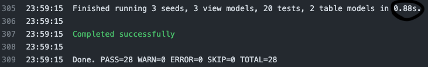
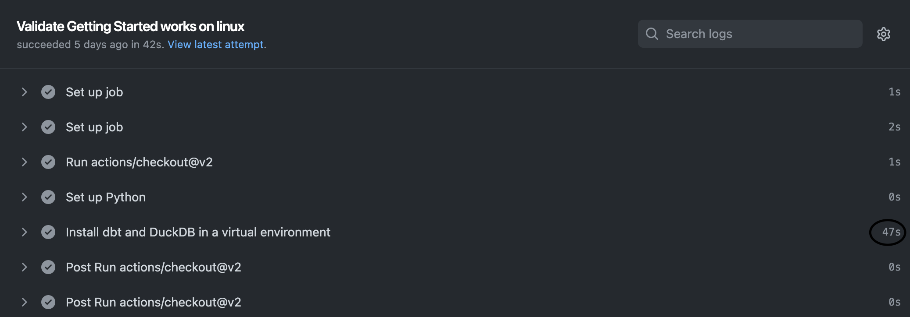
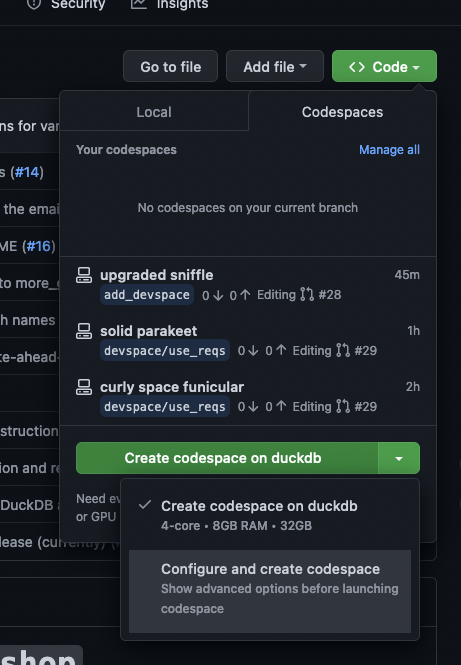

# Testing dbt project: `jaffle_shop`

`jaffle_shop` is a fictional ecommerce store. This dbt project transforms raw data from an app database into a customers and orders model ready for analytics.

<details>
<summary>

## What is this repo?

</summary>

What this repo _is_:
- A self-contained playground dbt project, useful for testing out scripts, and communicating some of the core dbt concepts.

What this repo _is not_:
- A tutorial — check out the [Getting Started Tutorial](https://docs.getdbt.com/tutorial/setting-up) for that. Notably, this repo contains some anti-patterns to make it self-contained, namely the use of seeds instead of sources.
- A demonstration of best practices — check out the [dbt Learn Demo](https://github.com/dbt-labs/dbt-learn-demo) repo instead. We want to keep this project as simple as possible. As such, we chose not to implement:
    - our standard file naming patterns (which make more sense on larger projects, rather than this five-model project)
    - a pull request flow
    - CI/CD integrations
- A demonstration of using dbt for a high-complex project, or a demo of advanced features (e.g. macros, packages, hooks, operations) — we're just trying to keep things simple here!

</details>

<details>
<summary>

## What's in this repo?

</summary>

This repo contains [seeds](https://docs.getdbt.com/docs/building-a-dbt-project/seeds) that includes some (fake) raw data from a fictional app along with some basic dbt [models](https://docs.getdbt.com/docs/building-a-dbt-project/building-models), tests, and docs for this data.

The raw data consists of customers, orders, and payments, with the following entity-relationship diagram:


</details>

## Why should I care about this repo?
If you're just starting your cloud data warehouse journey and are hungry to get started with dbt before your organization officially gets a data warehouse, you should check out this repo.

If you want to run 28 SQL operations with dbt in less than `1 second`, for free, and all on your local machine, you should check out this repo.


If you want an adrenaline rush from a process that used to take dbt newcomers `1 hour` and is now less than `1 minute`, you should check out this repo.



[Verified GitHub Action on dbt Performance](https://github.com/dbt-labs/jaffle_shop_duckdb/runs/7141529753?check_suite_focus=true#step:4:306)

## Running this project
Prerequisities: Python >= 3.5

### Mach Speed: No explanation needed

> Run `dbt` as fast as possible in a single copy and paste motion!

<details open>
<summary>POSIX bash/zsh</summary>

```shell
git clone https://github.com/dbt-labs/jaffle_shop_duckdb.git
cd jaffle_shop_duckdb
python3 -m venv venv
source venv/bin/activate
python3 -m pip install --upgrade pip
python3 -m pip install -r requirements.txt
source venv/bin/activate
dbt build
dbt docs generate
dbt docs serve
```
</details>

<details>
<summary>POSIX fish</summary>

```shell
git clone https://github.com/dbt-labs/jaffle_shop_duckdb.git
cd jaffle_shop_duckdb
python3 -m venv venv
source venv/bin/activate.fish
python3 -m pip install --upgrade pip
python3 -m pip install -r requirements.txt
source venv/bin/activate.fish
dbt build
dbt docs generate
dbt docs serve
```
</details>

<details>
<summary>POSIX csh/tcsh</summary>

```shell
git clone https://github.com/dbt-labs/jaffle_shop_duckdb.git
cd jaffle_shop_duckdb
python3 -m venv venv
source venv/bin/activate.csh
python3 -m pip install --upgrade pip
python3 -m pip install -r requirements.txt
source venv/bin/activate.csh
dbt build
dbt docs generate
dbt docs serve
```
</details>

<details>
<summary>POSIX PowerShell Core</summary>

```shell
git clone https://github.com/dbt-labs/jaffle_shop_duckdb.git
cd jaffle_shop_duckdb
python3 -m venv venv
venv/bin/Activate.ps1
python3 -m pip install --upgrade pip
python3 -m pip install -r requirements.txt
venv/bin/Activate.ps1
dbt build
dbt docs generate
dbt docs serve
```
</details>

<details>
<summary>Windows cmd.exe</summary>

```shell
git clone https://github.com/dbt-labs/jaffle_shop_duckdb.git
cd jaffle_shop_duckdb
python -m venv venv
venv\Scripts\activate.bat
python -m pip install --upgrade pip
python -m pip install -r requirements.txt
venv\Scripts\activate.bat
dbt build
dbt docs generate
dbt docs serve
```
</details>

<details>
<summary>Windows PowerShell</summary>

```shell
git clone https://github.com/dbt-labs/jaffle_shop_duckdb.git
cd jaffle_shop_duckdb
python -m venv venv
venv\Scripts\Activate.ps1
python -m pip install --upgrade pip
python -m pip install -r requirements.txt
venv\Scripts\Activate.ps1
dbt build
dbt docs generate
dbt docs serve
```
</details>

<details>
<summary>GitHub Codespaces / Dev Containers </summary>

#### Steps

1. Ensure you have [Codespaces](https://github.com/features/codespaces) enabled for your GitHub organization or turned on as a beta feature if you're an individual user
2. Click the green **Code** button on near the top right of the page of this repo's homepage (you may already be on it)
3. Instead of cloning the repo like you normally would, instead select the **Codespaces** tab of the pop out, then "Create codespace on `duckdb`"
   
4. Wait for codespace to boot (~1 min?)
5. Decide whether you'd like to use the Web IDE or open the codespace in your local environment
6. When the codespace opens, a Task pane will show up and call `dbt build` just to show you how it's done
7. Decide whether or not you'd like the recommended extensions installed (like **dbt Power User extension**)
8. Open up a new terminal and type:
    ```
    dbt build
    ```
9. Explore some of the bells and whistles (see below)

If you don't have Codespaces or would like to just run the environment in a local Docker container, you can by:
1. Install [Docker Desktop](https://www.docker.com/products/docker-desktop/)
2. Install the VSCode [Dev Containers](https://marketplace.visualstudio.com/items?itemName=ms-vscode-remote.remote-containers) extension (formerly known as the "Remote - Containers" extension). Video tutorial [here](https://learn.microsoft.com/en-us/shows/beginners-series-to-dev-containers/installing-the-remote-containers-extension-2-of-8--beginners-series-to-dev-containers).
2. Clone this repo and open it in VSCode
1. First time: View > Command Palette > Remote-Containers: Open Folder in Container
    - Wait for container to build -- expected to take several minutes
    - Open a new terminal
3. Subsequent times: Click **Reopen in Container** and wait for container to spin up
   
1. Continue on step 7 above


#### bells and whistles

There's some bells and whistles defined in the [.devcontainer.json]().devcontainer.json) that are worth calling out. Also a great reference is the [Setting up VSCode for dbt](https://dbt-msft.github.io/dbt-msft-docs/docs/guides/vscode_setup/) guide.

1. there is syntax highlighting provided by the `vdcode-dbt` extension. However, it is configured such that files in your `target/run` and `target/compiled` folder are not syntax highlighted, as a reminder that these files are not where you should be making changes!
2. basic `sqlfluff` linting is enabled as you type. Syntax errors will be underlined in red at the error, and will also be surfaced in the **Problems** tab of the Terminal pane. It's configured to lint as you type.
3. Autocompletion is enabled for generic dbt macros via the `vdcode-dbt` extension. For example, if you type `macro` you'll notice a pop up that you can select with the arrow keys then click tab to get a macro snippet.
  
  
4. the `find-related` extension allows an easy shortcut to navigating using `CMD`+`R`to jump from
    - a model file to it's corresponding compiled version,
    - from a compiled file to either the original model file or the version in `target/run`
5. The `vscode-yaml` YAML, combined with the JSON schema defined in [dbt-labs/dbt-jsonschema](https://github.com/dbt-labs/dbt-jsonschema), autocomplete options while working with dbt's YAML files: i.e. :
    - Project definition files (`dbt_project.yml`)
    - Package files (`packages.yml`)
    - Selectors files (`selectors.yml`)
    - Property files (`models/whatever.yml`)


</details>

### Step-by-step explanation

To get up and running with this project:

1. Clone this repository.

1. Change into the `jaffle_shop_duck` directory from the command line:
    ```shell
    cd jaffle_shop_duckdb
    ```

1. Install dbt and DuckDB in a virtual environment.

    Expand your shell below:

    <details open>
    <summary>POSIX bash/zsh</summary>

    ```shell
    python3 -m venv venv
    source venv/bin/activate
    python3 -m pip install --upgrade pip
    python3 -m pip install -r requirements.txt
    source venv/bin/activate
    ```
    </details>

    <details>
    <summary>POSIX fish</summary>

    ```shell
    python3 -m venv venv
    source venv/bin/activate.fish
    python3 -m pip install --upgrade pip
    python3 -m pip install -r requirements.txt
    source venv/bin/activate.fish
    ```
    </details>

    <details>
    <summary>POSIX csh/tcsh</summary>

    ```shell
    python3 -m venv venv
    source venv/bin/activate.csh
    python3 -m pip install --upgrade pip
    python3 -m pip install -r requirements.txt
    source venv/bin/activate.csh
    ```
    </details>

    <details>
    <summary>POSIX PowerShell Core</summary>

    ```shell
    python3 -m venv venv
    venv/bin/Activate.ps1
    python3 -m pip install --upgrade pip
    python3 -m pip install -r requirements.txt
    venv/bin/Activate.ps1
    ```
    </details>

    <details>
    <summary>Windows cmd.exe</summary>

    ```shell
    python -m venv venv
    venv\Scripts\activate.bat
    python -m pip install --upgrade pip
    python -m pip install -r requirements.txt
    venv\Scripts\activate.bat
    ```
    </details>

    <details>
    <summary>Windows PowerShell</summary>

    ```shell
    python -m venv venv
    venv\Scripts\Activate.ps1
    python -m pip install --upgrade pip
    python -m pip install -r requirements.txt
    venv\Scripts\Activate.ps1
    ```
    </details>


  
    *Why a 2nd activation of the virtual environment?*
    <details>
    <summary>This may not be necessary for many users, but might be for some. Read on for a first-person report from @dbeatty10.</summary>

    I use `zsh` as my shell on my MacBook Pro, and I use `pyenv` to manage my Python environments. I already had an alpha version of dbt Core 1.2 installed (and yet another via [pipx](https://pypa.github.io/pipx/installation/)):
    ```shell
    $ which dbt
    /Users/dbeatty/.pyenv/shims/dbt
    ```
    ```shell
    $ dbt --version
    Core:
      - installed: 1.2.0-a1
      - latest:    1.1.1    - Ahead of latest version!

    Plugins:
      - bigquery:  1.2.0a1 - Ahead of latest version!
      - snowflake: 1.2.0a1 - Ahead of latest version!
      - redshift:  1.2.0a1 - Ahead of latest version!
      - postgres:  1.2.0a1 - Ahead of latest version!
    ```

    Then I ran all the steps to create a virtual environment and install the requirements of our DuckDB-based Jaffle Shop repo:
    ```shell
    $ python3 -m venv venv
    $ source venv/bin/activate
    (venv) $ python3 -m pip install --upgrade pip
    (venv) $ python3 -m pip install -r requirements.txt
    ```

    Let's examine where `dbt` is installed and which version it is reporting:
    ```shell
    (venv) $ which dbt
    /Users/dbeatty/projects/jaffle_duck/venv/bin/dbt
    ```

    ```shell
    (venv) $ dbt --version
    Core:
      - installed: 1.2.0-a1
      - latest:    1.1.1    - Ahead of latest version!

    Plugins:
      - bigquery:  1.2.0a1 - Ahead of latest version!
      - snowflake: 1.2.0a1 - Ahead of latest version!
      - redshift:  1.2.0a1 - Ahead of latest version!
      - postgres:  1.2.0a1 - Ahead of latest version!
    ```

    ❌ That isn't what we expected -- something isn't right. 😢

    So let's reactivate the virtual environment and try again...
    ```shell
    (venv) $ source venv/bin/activate
    ```

    ```shell
    (venv) $ dbt --version
    Core:
      - installed: 1.1.1
      - latest:    1.1.1 - Up to date!

    Plugins:
      - postgres: 1.1.1 - Up to date!
      - duckdb:   1.1.3 - Up to date!
    ```

    ✅ This is what we want -- the 2nd reactivation worked. 😎 
    </details>

1. Ensure your [profile](https://docs.getdbt.com/reference/profiles.yml) is setup correctly from the command line:
    ```shell
    dbt --version
    dbt debug
    ```

1. Load the CSVs with the demo data set, run the models, and test the output of the models using the [dbt build](https://docs.getdbt.com/reference/commands/build) command:
    ```shell
    dbt build
    ```

1. Query the data:

    Launch a DuckDB command-line interface (CLI):
    ```shell
    duckcli jaffle_shop.duckdb
    ```

    Run a query at the prompt and exit:
    ```
    select * from customers where customer_id = 42;
    exit;
    ```

    Alternatively, use a single-liner to perform the query:
    ```shell
    duckcli jaffle_shop.duckdb -e "select * from customers where customer_id = 42"
    ```
    or:
    ```shell
    echo 'select * from customers where customer_id = 42' | duckcli jaffle_shop.duckdb
    ```

1. Generate and view the documentation for the project:
    ```shell
    dbt docs generate
    dbt docs serve
    ```

## Running `build` steps independently

1. Load the CSVs with the demo data set. This materializes the CSVs as tables in your target schema. Note that a typical dbt project **does not require this step** since dbt assumes your raw data is already in your warehouse.
    ```shell
    dbt seed
    ```

1. Run the models:
    ```shell
    dbt run
    ```

    > **NOTE:** If you decide to run this project in your own data warehouse (outside of this DuckDB demo) and steps fail, it might mean that you need to make small changes to the SQL in the models folder to adjust for the flavor of SQL of your target database. Definitely consider this if you are using a community-contributed adapter.

1. Test the output of the models using the [test](https://docs.getdbt.com/reference/commands/test) command:
    ```shell
    dbt test
    ```

## Browsing the data
Some options:
- [duckcli](https://pypi.org/project/duckcli/)
- [DuckDB CLI](https://duckdb.org/docs/installation/?environment=cli)
- [How to set up DBeaver SQL IDE for DuckDB](https://duckdb.org/docs/guides/sql_editors/dbeaver)

### Troubleshooting

You may get an error like this, in which case you will need to disconnect from any sessions that are locking the database:
```
IO Error: Could not set lock on file "jaffle_shop.duckdb": Resource temporarily unavailable
```

This is a known issue in DuckDB. If you are using DBeaver, this means shutting down DBeaver (merely disconnecting didn't work for me).

Very worst-case, deleting the database file will get you back in action (BUT you will lose all your data).


#### GitHub Codespaces and VSCode Remote Container

If you're using a privacy-forward browser such as Firefox and Brave, or a tracking-cookie-blocking extension like UBlock Origin or Privacy Badger, you may see the below error. You can either change your cookie settings, use a browser like Chrome, or just ignore the error because it doesn't affect the demo


---
For more information on dbt:
- Read the [introduction to dbt](https://docs.getdbt.com/docs/introduction)
- Read the [dbt viewpoint](https://docs.getdbt.com/docs/about/viewpoint)
- Join the [dbt Community](http://community.getdbt.com/)
