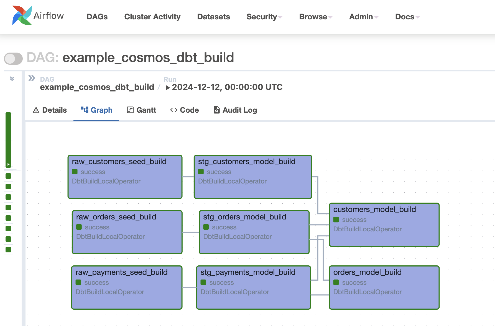

.. _testing-behavior:

Testing Behavior
================

Testing Configuration
---------------------

By default, Cosmos will add a test after each model. This can be overridden using the ``test_behavior`` field in the ``RenderConfig`` object.
Note that this behavior is different from dbt's default behavior, which runs all tests after all models have been run.
Cosmos defaults to running tests after each model to take a "fail-fast" approach to testing. This means that if a model
runs with failing tests, the rest of the project is stopped and the failure is reported. This is in contrast to dbt's
default behavior, which runs all models and tests, and then reports all failures at the end.

Cosmos supports the following test behaviors:

- ``after_each`` (default): turns each model into a task group with two steps: run the model, and run the tests
- ``build``: run dbt resources using the ``dbt build`` command, using a single task. This applies to dbt models, seeds and snapshots.
- ``after_all``: each model becomes a single task, and the tests only run if all models are run successfully
- ``none``: don't include tests

Example of the standard behavior of ``TestBehavior.AFTER_EACH``,
when using the example DAG available in ``dev/dags/basic_cosmos_dag.py``:

.. image:: ../_static/test_behavior_after_each.png

Example when changing the behavior to use ``TestBehavior.AFTER_ALL``:

.. code-block:: python

    from cosmos import DbtTaskGroup, RenderConfig
    from cosmos.constants import TestBehavior

    jaffle_shop = DbtTaskGroup(
        render_config=RenderConfig(
            test_behavior=TestBehavior.AFTER_ALL,
        )
    )

.. image:: ../_static/test_behavior_after_all.png

Finally, an example DAG and how it is rendered in the Airflow UI when using ``TestBehavior.BUILD``:

.. literalinclude::  ../../dev/dags/example_cosmos_dbt_build.py
    :language: python
    :start-after: [START build_example]
    :end-before: [END build_example]

Warning Behavior
----------------

.. note::

    As of now, this feature is only available for the default execution mode ``local`` and for ``virtualenv``

Cosmos enables you to receive warning notifications from tests and process them using a callback function.
The ``on_warning_callback`` parameter adds two extra context variables to the callback function: ``test_names`` and ``test_results``.
``test_names`` contains the names of the tests that generated a warning, while ``test_results`` holds the corresponding test results
at the same index. Both the ``test_names`` and ``test_results`` variables are lists of strings.

For example, the following code snippet shows how to send a Slack message when a warning occurs:

.. code-block:: python

    from cosmos import DbtDag
    from airflow.providers.slack.hooks.slack_webhook import SlackWebhookHook
    from airflow.utils.context import Context

    def warning_callback_func(context: Context):
        tests = context.get("test_names")
        results = context.get("test_results")

        warning_msgs = ""
        for test, result in zip(tests, results):
            warning_msg = f"""
            *Test*: {test}
            *Result*: {result}
            """
            warning_msgs += warning_msg

        if warning_msgs:
            slack_msg = f"""
            :large_yellow_circle: Airflow-DBT task with WARN.
            *Task*: {context.get('task_instance').task_id}
            *Dag*: {context.get('task_instance').dag_id}
            *Execution Time*: {context.get('execution_date')}
            *Log Url*: {context.get('task_instance').log_url}
            {warning_msgs}
            """

            slack_hook = SlackWebhookHook(slack_webhook_conn_id="slack_conn_id")
            slack_hook.send(text=slack_msg)

    mrr_playbook = DbtDag(
        # ...
        on_warning_callback=warning_callback_func,
    )

When at least one WARN message is present, the function passed to ``on_warning_callback`` will be triggered. In the example above, the following message will be sent to Slack:

.. figure:: https://github.com/astronomer/astronomer-cosmos/raw/main/docs/_static/callback_slack.png
   :width: 600

.. note::

    If warnings that are not associated with tests occur (e.g. freshness warnings), they will still trigger the
    ``on_warning_callback`` method above. However, these warnings will not be included in the ``test_names`` and
    ``test_results`` context variables, which are specific to test-related warnings.
