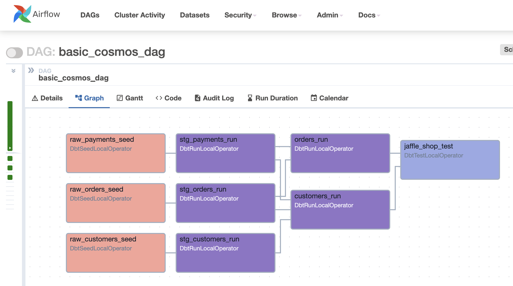

.. _testing-behavior:

Testing Behavior
================

Testing Configuration
---------------------

By default, Cosmos will add a test after each model. This can be overridden using the ``test_behavior`` field in the ``RenderConfig`` object.
Note that this behavior is different from dbt's default behavior, which runs all tests after all models have been run.
Cosmos defaults to running tests after each model to take a "fail-fast" approach to testing. This means that if a model
runs with failing tests, the rest of the project is stopped and the failure is reported. This is in contrast to dbt's
default behavior, which runs all models and tests, and then reports all failures at the end.

Cosmos supports the following test behaviors:

- ``after_each`` (default): turns each model into a task group with two steps: run the model, and run the tests
- ``build``: (since Cosmos 1.8) run dbt resources using the ``dbt build`` command, using a single task. This applies to dbt models, seeds and snapshots.
- ``after_all``: each model becomes a single task, and the tests only run if all models are run successfully
- ``none``: don't include tests

Example of the standard behavior of ``TestBehavior.AFTER_EACH``,
when using the example DAG available in ``dev/dags/basic_cosmos_dag.py``:

.. image:: ../_static/test_behavior_after_each.png

Example when changing the behavior to use ``TestBehavior.AFTER_ALL``:

.. code-block:: python

    from cosmos import DbtTaskGroup, RenderConfig
    from cosmos.constants import TestBehavior

    jaffle_shop = DbtTaskGroup(
        render_config=RenderConfig(
            test_behavior=TestBehavior.AFTER_ALL,
        )
    )

Finally, an example DAG and how it is rendered in the Airflow UI when using ``TestBehavior.BUILD`` (available since Cosmos 1.8):

.. literalinclude::  ../../dev/dags/example_cosmos_dbt_build.py
    :language: python
    :start-after: [START build_example]
    :end-before: [END build_example]

.. image:: ../_static/test_behavior_build.png

Warning Behavior
----------------

.. note::

    As of now, this feature is only available for the default execution mode ``local`` and for ``virtualenv``

Cosmos enables you to receive warning notifications from tests and process them using a callback function.
The ``on_warning_callback`` parameter adds two extra context variables to the callback function: ``test_names`` and ``test_results``.
``test_names`` contains the names of the tests that generated a warning, while ``test_results`` holds the corresponding test results
at the same index. Both the ``test_names`` and ``test_results`` variables are lists of strings.

For example, the following code snippet shows how to send a Slack message when a warning occurs:

.. code-block:: python

    from cosmos import DbtDag
    from airflow.providers.slack.hooks.slack_webhook import SlackWebhookHook
    from airflow.utils.context import Context

    def warning_callback_func(context: Context):
        tests = context.get("test_names")
        results = context.get("test_results")

        warning_msgs = ""
        for test, result in zip(tests, results):
            warning_msg = f"""
            *Test*: {test}
            *Result*: {result}
            """
            warning_msgs += warning_msg

        if warning_msgs:
            slack_msg = f"""
            :large_yellow_circle: Airflow-DBT task with WARN.
            *Task*: {context.get('task_instance').task_id}
            *Dag*: {context.get('task_instance').dag_id}
            *Execution Time*: {context.get('execution_date')}
            *Log Url*: {context.get('task_instance').log_url}
            {warning_msgs}
            """

            slack_hook = SlackWebhookHook(slack_webhook_conn_id="slack_conn_id")
            slack_hook.send(text=slack_msg)

    mrr_playbook = DbtDag(
        # ...
        on_warning_callback=warning_callback_func,
    )

When at least one WARN message is present, the function passed to ``on_warning_callback`` will be triggered. In the example above, the following message will be sent to Slack:

.. figure:: https://github.com/astronomer/astronomer-cosmos/raw/main/docs/_static/callback_slack.png
   :width: 600

.. note::

    If warnings that are not associated with tests occur (e.g. freshness warnings), they will still trigger the
    ``on_warning_callback`` method above. However, these warnings will not be included in the ``test_names`` and
    ``test_results`` context variables, which are specific to test-related warnings.

Tests with Multiple Parents
---------------------------

It is common for dbt projects to define tests that rely on multiple upstream models, snapshots or seeds.
By default, Cosmos will attempt to run these tests using the behavior defined using ``test_behavior`` as previously explained.

As an example, if there is a test that depends on multiple models (``model_a`` and ``combined_model``), and the DAG uses
``TestBehavior.AFTER_EACH``, Cosmos will attempt to run this test twice after each model run.

While the standard behavior of Cosmos works for many cases, there are a few scenarios when the test fails unless both models
run. To overcome this issue, starting in Cosmos 1.8.2, we introduced the parameter
``should_detach_multiple_parents_tests`` in ``RenderConfig``. By default, it is ``False``. If it is set to ``True`` and
``TestBehavior` is ``AFTER_EACH`` or ``BUILD``, Cosmos will identify all the test nodes that depend on multiple parents
and will create a standalone test task for each of them.

Cosmos will attempt to name this task after the test's original name. However, since some test names can exceed 250 characters and Airflow does not support IDs longer than this limit, Cosmos will assign names like “detached_0_test,” incrementing the number as needed.

The DAG `example_tests_multiple_parents <https://github.com/astronomer/astronomer-cosmos/blob/main/dev/dags/example_tests_multiple_parents.py>`_ illustrates this behavior.
It renders a dbt project named `multiple_parents_test <https://github.com/astronomer/astronomer-cosmos/tree/main/dev/dags/dbt/multiple_parents_test>`_ that has a test called `custom_test_combined_model <https://github.com/astronomer/astronomer-cosmos/blob/main/dev/dags/dbt/multiple_parents_test/macros/custom_test_combined_model.sql>`_ that depends on two models:

- **combined_model**
- **model_a**

By default, Cosmos will error:

.. code-block::

    [2024-12-27T12:07:33.564+0000] {taskinstance.py:2905} ERROR - Task failed with exception
    Traceback (most recent call last):
      File "/Users/tati/Code/cosmos-clean/astronomer-cosmos/venvpy39/lib/python3.9/site-packages/airflow/models/taskinstance.py", line 465, in _execute_task
        result = _execute_callable(context=context, **execute_callable_kwargs)
      File "/Users/tati/Code/cosmos-clean/astronomer-cosmos/venvpy39/lib/python3.9/site-packages/airflow/models/taskinstance.py", line 432, in _execute_callable
        return execute_callable(context=context, **execute_callable_kwargs)
      File "/Users/tati/Code/cosmos-clean/astronomer-cosmos/venvpy39/lib/python3.9/site-packages/airflow/models/baseoperator.py", line 401, in wrapper
        return func(self, *args, **kwargs)
      File "/Users/tati/Code/cosmos-clean/astronomer-cosmos/cosmos/operators/local.py", line 796, in execute
        result = self.build_and_run_cmd(context=context, cmd_flags=self.add_cmd_flags())
      File "/Users/tati/Code/cosmos-clean/astronomer-cosmos/cosmos/operators/local.py", line 654, in build_and_run_cmd
        result = self.run_command(cmd=dbt_cmd, env=env, context=context)
      File "/Users/tati/Code/cosmos-clean/astronomer-cosmos/cosmos/operators/local.py", line 509, in run_command
        self.handle_exception(result)
      File "/Users/tati/Code/cosmos-clean/astronomer-cosmos/cosmos/operators/local.py", line 237, in handle_exception_dbt_runner
        raise AirflowException(f"dbt invocation completed with errors: {error_message}")
    airflow.exceptions.AirflowException: dbt invocation completed with errors: custom_test_combined_model_combined_model_: Database Error in test custom_test_combined_model_combined_model_ (models/schema.yml)
      relation "public.combined_model" does not exist
      LINE 12:     SELECT id FROM "postgres"."public"."combined_model"
                                  ^
      compiled Code at target/run/my_dbt_project/models/schema.yml/custom_test_combined_model_combined_model_.sql

However, if users set ``should_detach_multiple_parents_tests=True``, the test will be detached, as illustrated below.
The test will only run once after both models run, leading the DAG to succeed:

.. code-block:: python

    from cosmos import DbtDag, RenderConfig

    example_multiple_parents_test = DbtDag(
        ...,
        render_config=RenderConfig(
            should_detach_multiple_parents_tests=True,
        ),
    )

