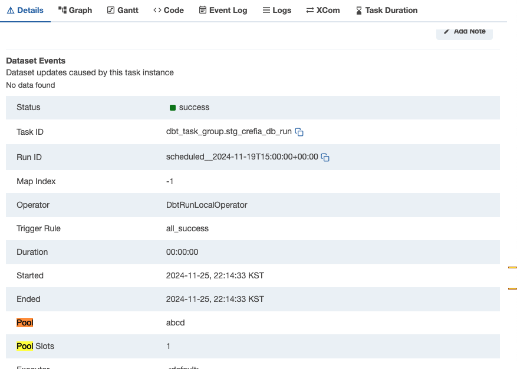

.. _custom-airflow-properties:

Airflow Configuration Overrides with Astronomer Cosmos
======================================================

**Astronomer Cosmos** allows you to override Airflow configurations for each dbt task (dbt operator) via the dbt YAML file.

Sample dbt Model YAML
+++++++++++++++++++++

.. code-block:: yaml

    version: 2
    models:
      - name: name
        description: description
        meta:
          cosmos:
            operator_args:
                pool: abcd

Explanation
++++++++++++

By adding Airflow configurations under **cosmos** in the **meta** field, you can set independent Airflow configurations for each task.
For example, in the YAML above, the **pool** setting is applied to the specific dbt task.
This approach allows for more granular control over Airflow settings per task within your dbt model definitions.

