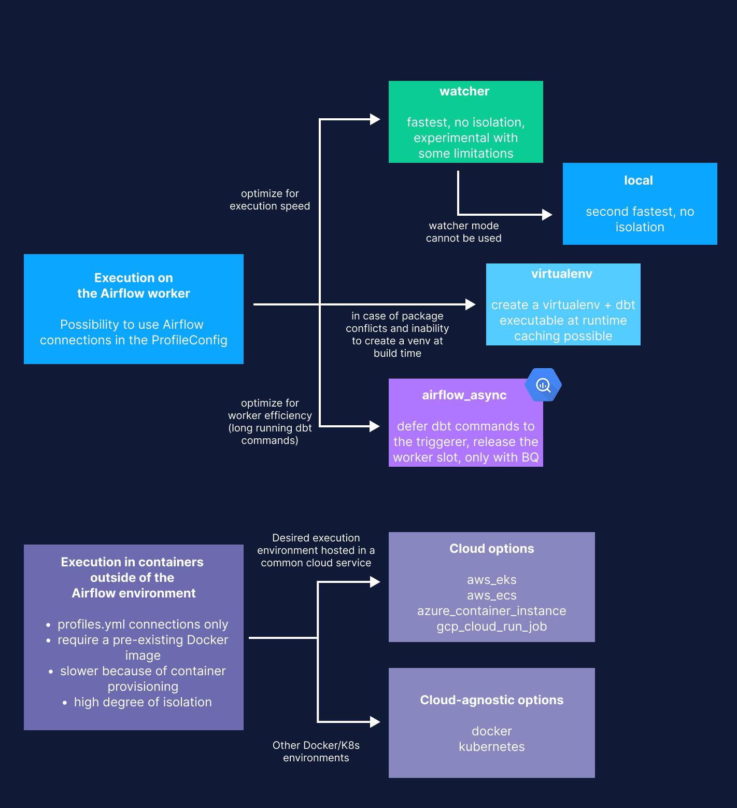

.. _execution-modes:

Choose an execution mode
========================

The ```ExecutionConfig`` defines your execution mode, which determines where and how dbt commands run in Cosmos.

There are two types of execution modes:

1. **Execute dbt commands on the Airflow worker or triggerer.** These execution modes offer faster
execution times, since no extra container needs to be spun up, but no or limited environment isolation.
There are four options for this type of execution mode: ``watcher``, ``local``, ``virtualenv``, and ``airflow_async``.
``airflow_async`` is available for BigQuery as of Cosmos 1.9 and ``watcher`` is available as of Cosmos 1.11.

2. **Execute dbt commands in a container outside of your Airflow environment.** This type of execution mode offers high levels of environment isolation, and also allows you to spin up the Docker or
Kubernetes container in various cloud or on-premises environments

The following diagram shows a decision tree to help you select the right execution mode for your project needs.




On the Airflow worker or triggerer
~~~~~~~~~~~~~~~~~~~~~~~~~~~~~~~~~~

These execution modes offer faster execution times, since your don't need to spin up any extra containers. You can also use Airflow connections via the ``ProfileConfig``. But, these execution modes do not have any, or offer limited, environment isolation. There are four execution mode options that run on the Airflow worker:

- `local <./airflow-worker/local-execution-mode.html>`_: Default execution mode, but provides no environment isolation. Run ``dbt`` commands using a local ``dbt`` installation (default)
- `watcher <./airflow-worker/watcher-execution-mode.html>`_: (Experimental since Cosmos 1.11.0) Optimized for execution speed. Run a single ``dbt build`` command from a producer task and have sensor tasks to watch the progress of the producer, with improved DAG run time while maintaining the tasks lineage in the Airflow UI, and ability to retry failed tasks.
- `virtualenv <./airflow-worker/cosmos-managed-venv.html>`_: Allows you to address package conflicts and an inability to create a venv at build time. Run ``dbt`` commands from Python virtual environments managed by Cosmos. This
- `airflow_async <./airflow-worker/async-execution-mode.html>`_: (Stable since Cosmos 1.9.0) Optimized for worker efficiency if you have long-running dbt commands. Run the dbt resources from your dbt project asynchronously, by submitting the corresponding compiled SQLs to Apache Airflow's `Deferrable operators <https://airflow.apache.org/docs/apache-airflow/stable/authoring-and-scheduling/deferring.html>`__

In a container
~~~~~~~~~~~~~~

You can also execute dbt commands in a container outside of the Airflow environment. Choosing these kinds of execution modes provides a high degree of isolation, but requires that you can only create Airflow connections with the dbt ``profiles.yml`` file, requires a pre-existing Docker image, and has slower run times, because of container provisioning.

- `docker <./container/docker.html>`_ : Run ``dbt`` commands from Docker containers managed by Cosmos (requires a pre-existing Docker image)
- `kubernetes <./container/kubernetes.html>`_: Run ``dbt`` commands from Kubernetes Pods managed by Cosmos (requires a pre-existing Docker image)
- `watcher_kubernetes <./container/watcher-kubernetes-execution-mode.html>`_: (experimental since Cosmos 1.13.0) Combines the speed of the watcher execution mode with the isolation of Kubernetes. Check the :ref:`watcher-kubernetes-execution-mode` for more details.
- `aws_ecs <./container/aws-container-run-job.html>`_: Run ``dbt`` commands from AWS ECS instances managed by Cosmos (requires a pre-existing Docker image)
- `aws_eks <./container/aws-eks.html>`_: Run ``dbt`` commands from AWS EKS Pods managed by Cosmos (requires a pre-existing Docker image)
- `azure_container_instance <./container/azure-container-instance.html>`_: Run ``dbt`` commands from Azure Container Instances managed by Cosmos (requires a pre-existing Docker image)
- `gcp_cloud_run_job <./container/gcp-cloud-run-job.html>`_: Run ``dbt`` commands from GCP Cloud Run Job instances managed by Cosmos (requires a pre-existing Docker image).

.. _execution-modes-comparison:

Execution modes comparison
~~~~~~~~~~~~~~~~~~~~~~~~~~

The type of execution mode that you choose directly affects how fast your Cosmos Dag runs.

.. list-table:: Execution Modes Comparison
   :widths: 25 25 25 25
   :header-rows: 1

   * - Execution Mode
     - Task Duration
     - Environment Isolation
     - Cosmos Profile Management
   * - Local
     - Fast
     - None
     - Yes
   * - Watcher
     - Very Fast
     - None
     - Yes
   * - Virtualenv
     - Medium
     - Lightweight
     - Yes
   * - Airflow Async
     - Very Fast
     - Medium
     - Yes
   * - Docker
     - Slow
     - Medium
     - No
   * - Kubernetes
     - Slow
     - High
     - No
   * - Watcher Kubernetes
     - Fast
     - High
     - No
   * - AWS ECS
     - Slow
     - High
     - No
   * - AWS_EKS
     - Slow
     - High
     - No
   * - Azure Container Instance
     - Slow
     - High
     - No
   * - GCP Cloud Run Job Instance
     - Slow
     - High
     - No