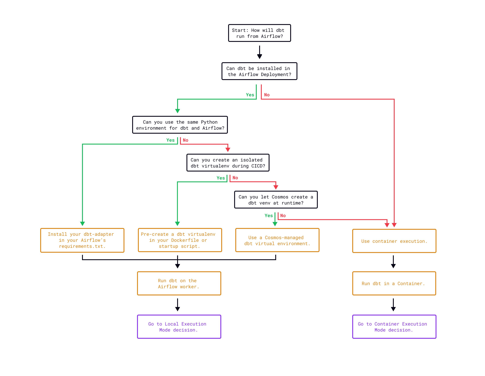
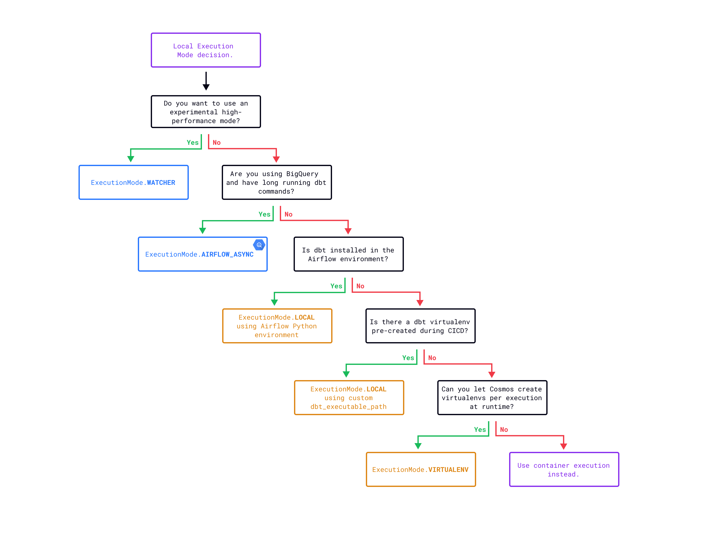
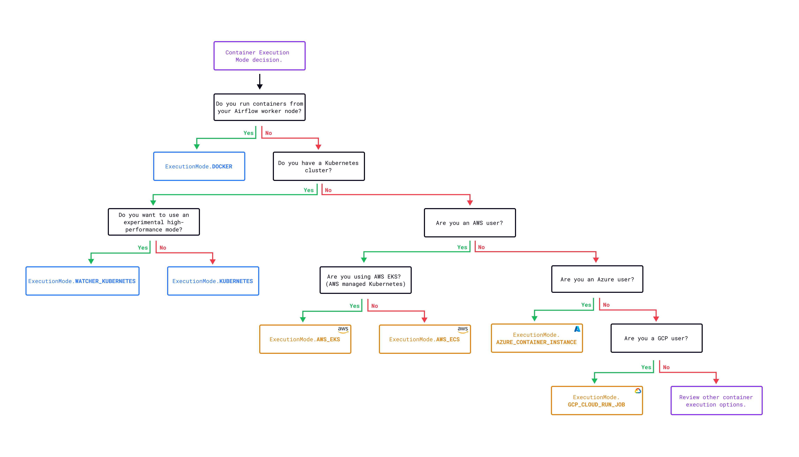

.. _execution-modes:

Choose an execution mode
========================

The ```ExecutionConfig`` class defines your execution mode, which determines where and how Cosmos runs dbt commands.

There are two categories of execution modes:

1. **Execute dbt commands on the Airflow worker.** These execution modes offer faster execution times, since no extra container needs to be spun up. But, they also don't offer environment isolation, or only provide limited isolation. There are four options for this type of execution mode: ``watcher``, ``local``, ``virtualenv``, and ``airflow_async``. ``airflow_async`` is available for BigQuery as of Cosmos 1.9 and ``watcher`` is available as of Cosmos 1.11.

2. **Execute dbt commands in a container** This type of execution mode offers high levels of environment isolation and also allows you to run dbt from either containers or external jobs, in both on-premises environments and various cloud services. There are multiple options for this type of execution mode: ``docker``, ``kubernetes``, ``watcher_kubernetes``, ``aws_ecs``, ``aws_eks``, ``azure_container_instance``, and ``gcp_cloud_run_job``.

Choose between local and container execution mode types
~~~~~~~~~~~~~~~~~~~~~~~~~~~~~~~~~~~~~~~~~~~~~~~~~~~~~~~

To decide which execution mode you want to use, first select whether you want to use one that runs on the Airflow worker node, or to use one that runs in a container.

The following decision tree can help you pick which type works best for your Cosmos project by considering your setup:



On the Airflow worker
~~~~~~~~~~~~~~~~~~~~~~

These execution modes offer faster execution times, since you don't need to spin up any extra containers. You can also use Airflow connections via the ``ProfileConfig``. But, these execution modes do not have any, or offer limited, environment isolation.

There are four execution mode options that run on the Airflow worker:

- :ref:`local <local-execution>`: Default execution mode in Cosmos 1.x. In this mode, a dbt command is executed for each dbt node (one dbt command per Airflow task). The dbt project is reparsed during every task execution. By default, each task runs a single dbt node and relies on a user-preinstalled dbt. This mode can operate in two ways:

  - **No isolation**: dbt is installed in the same Python virtual environment as Airflow. In this case, Cosmos can invoke dbt commands as a library rather than as a subprocess, leading to performance gains.
  - **Partial isolation**: Create a dedicated Python virtual environment in the Airflow deployment, install dbt there, and configure Cosmos to use it by setting ``ExecutionConfig.dbt_executable_path``. This provides a good solution for dependency conflicts.

- :ref:`watcher <watcher-execution-mode>`: (Experimental since Cosmos 1.11.0) Optimized for execution speed. Run a single ``dbt build`` command from a producer task and have sensor tasks to watch the progress of the producer, with improved DAG run time while maintaining the tasks lineage in the Airflow UI, and ability to retry failed tasks.
- :ref:`virtualenv <cosmos-managed-venv>`: Runs dbt commands from Python virtual environments created and managed by Cosmos. This mode removes the need to create a virtual environment at build time, unlike ``ExecutionMode.LOCAL``, while avoiding package conflicts. It is intended for cases where:

  - **Can't install dbt directly**: If you can't install dbt in the Airflow environment (either in the same environment or a dedicated one).
  - **Multiple dbt installations are required**: If you require multiple dbt installations and you prefer Cosmos to manage them without modifying the Airflow deployment.

  In most cases, the local execution mode with ``ExecutionConfig.dbt_executable_path`` is the preferred option instead of ``virtualenv``, because local mode with ``ExecutionConfig.dbt_executable_path`` allows you to manage the dbt environment while keeping the Airflow deployment simpler.

- :ref:`airflow_async <async-execution-mode>`: (Stable since Cosmos 1.9.0) Optimized for worker efficiency if you have long-running dbt commands. Currently only works with BigQuery. Pre-compile the SQL transformations with dbt in a setup task and execute them asynchronously using Apache Airflow's `Deferrable operators <https://airflow.apache.org/docs/apache-airflow/stable/authoring-and-scheduling/deferring.html>`__.

Choose your local execution mode type
++++++++++++++++++++++++++++++++++++++

If you want to use an execution mode that can run in the Airflow worker node, use the following workflow to choose how to customize its behavior or decide that you want to use the container type of execution mode.




In a container
~~~~~~~~~~~~~~

You can also execute dbt commands in a container. Choosing these kinds of execution modes provides a high degree of isolation. However, they come with limitations where you can only create Airflow connections with the dbt ``profiles.yml`` file and it has slower run times because of container provisioning. They all also require a pre-existing Docker image.

- :ref:`docker <docker>` : Run ``dbt`` commands via Docker containers inside the Airflow worker node.
- :ref:`kubernetes <kubernetes>`: Run ``dbt`` commands within Kubernetes Pods managed by Cosmos.
- :ref:`watcher_kubernetes <watcher-kubernetes-execution-mode>`: (experimental since Cosmos 1.13.0) Combines the speed of the watcher execution mode with the isolation of Kubernetes.
- :ref:`aws_ecs <aws-container-run-job>`: Run ``dbt`` commands in containers via AWS ECS.
- :ref:`aws_eks <aws-eks>`: Run ``dbt`` commands via Kubernetes Pods in AWS EKS.
- :ref:`azure_container_instance <azure-container-instance>`: Run ``dbt`` commands in Azure Container Instances.
- :ref:`gcp_cloud_run_job <gcp-cloud-run-job>`: Run ``dbt`` commands via a container managed by GCP Cloud Run Job.


Choose your container execution mode type
++++++++++++++++++++++++++++++++++++++++++

If you want to use a container execution mode, use the following decision tree to decide which kind of container execution mode works best for your project needs.





.. _execution-modes-comparison:

Execution modes comparison
~~~~~~~~~~~~~~~~~~~~~~~~~~

The type of execution mode that you choose directly affects how fast your Cosmos Dag runs.

.. list-table:: Execution Modes Comparison
   :widths: 25 25 25 25
   :header-rows: 1

   * - Execution Mode
     - Task Duration
     - Environment Isolation
     - Cosmos Profile Management
   * - Local
     - Fast
     - None/Lightweight
     - Yes
   * - Watcher
     - Very Fast
     - None/Lightweight
     - Yes
   * - Virtualenv
     - Medium
     - Lightweight
     - Yes
   * - Airflow Async
     - Very Fast
     - Lightweight/Medium
     - Yes
   * - Docker
     - Slow
     - Medium
     - No
   * - Kubernetes
     - Slow
     - High
     - No
   * - Watcher Kubernetes
     - Fast
     - High
     - No
   * - AWS ECS
     - Slow
     - High
     - No
   * - AWS_EKS
     - Slow
     - High
     - No
   * - Azure Container Instance
     - Slow
     - High
     - No
   * - GCP Cloud Run Job Instance
     - Slow
     - High
     - No
